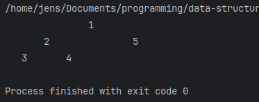
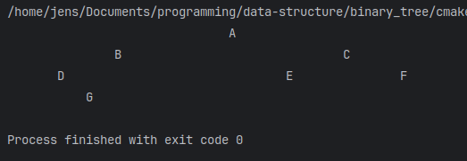
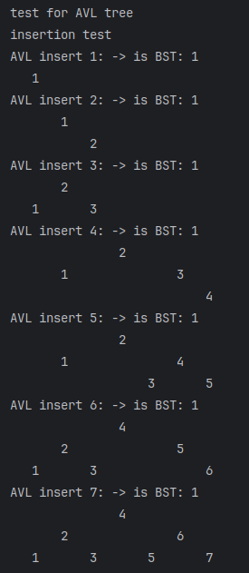
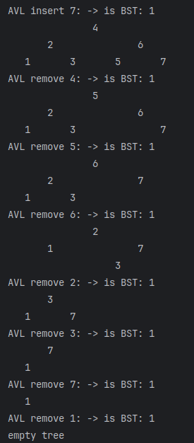
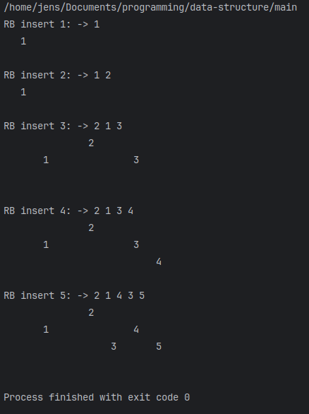
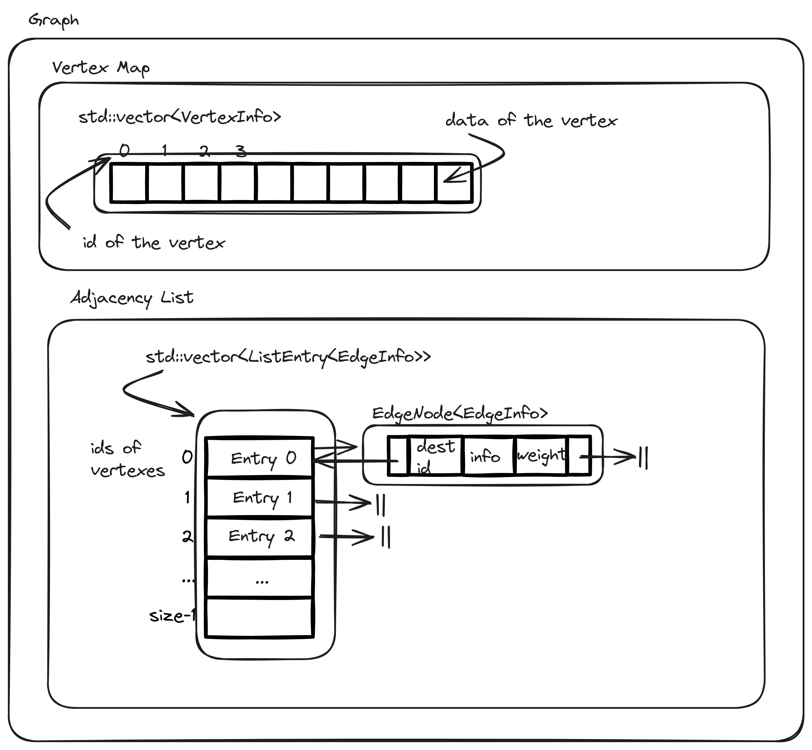

# Data Structure

<aside>
💡 Reference: ***Thomas H. Cormen, Charles E. Leiserson, Ronald L. Rivest, and Clifford Stein. 2009. Introduction to Algorithms, Third Edition (3rd. ed.). The MIT Press.***

</aside>

# Linked List

[See the project](https://github.com/JensLiu/data-structure/tree/main/linked_list)

<aside>
💡 This implementation is a circular doubly linked list

</aside>

### Operations

- `insertBefore`/`insertAfte` an `iterator`
- `pushFront` to the list
- `pushBack` to the list
- `find` an element
- `breakFree`(remove) the element at an iterator
- `erase` every element of the list
- `saveToFile`: save the list to a binary file
- `readFromFile`: read the binary file to a list
- `quickSort` the list
    
    <aside>
    👉🏻 Example
    
    ```cpp
    // generate random numbers
    LinkedList<int> list;
    for (int i = 0; i < 1000000; i++) {
        list.pushBack((int)random());
    }
    
    // sort
    list.quicksort(list.begin(), list.end(), [](int i, int j) { return i < j; } );
    
    // test
    auto p = list.begin();
    auto p1 = p->data;
    p++;
    while (p != list.end()) {
        if (p1 > p->data) {
            throw std::runtime_error("sort failed");
        }
        p1 = p->data;
        p++;
    }
    std::cout << "\nsort success\n";
    return 0;
    ```
    
    </aside>
    

# Binary Tree

[See the project](https://github.com/JensLiu/data-structure/tree/main/binary_tree)

<aside>
💡 Reference: ***CLRS*** : chap. 12-13

</aside>

## `BSTNode` is a generic tree node for Binary Tree, BST, AVL Tree and Red-Black Tree

It contains generic metadata about its `parent`, `left` child, `right` child and its `key`

<aside>
💡 For AVL tree, it stores its `height` for balancing purpose. It is updated on each operation

</aside>

<aside>
💡 For red-black tree, it stores its `nodeColour` and whether it `isNilNode`

</aside>

<aside>
💡 See `bst_node.h`

</aside>

<aside>
👀 It should be better named as `BTNode` rather than `BSTNode` …

</aside>

```cpp
template <typename T>
class BSTNode {
public:
    enum Colour{ BLACK = 0, RED};
public:
    BSTNode<T>* parent;
    BSTNode<T>* left;
    BSTNode<T>* right;
    T key;
    int height;

    // this is for red-black tree, ignore when it's not the case
    Colour nodeColour;
    // this is a flag for nil node that symbols the lack of node, ignore when it's not the case
    bool isNilNode;
}
```

## `BinaryTree` is a generic binary tree

It only maintains its `root` node

<aside>
💡 see `binary_tree.h`

</aside>

```cpp
template <typename T>
class BinaryTree {

protected:
    BSTNode<T>* root;
...
}
```

### Some Operations

- check if this tree `isBST`
- doing recursive and iterative `preOrderWalk`, `inOrderWalk` and `postOrderWalk` sequence
    
    <aside>
    👉🏻 Example
    
    </aside>
    
- construct binary tree using pre-order and in-order sequences`preAndInWalkInsert`, or post-order and in-order sequence `postAndInWalkInsert`.
    
    <aside>
    👉🏻 Example
    
    Code
    
    ```cpp
    BinaryTree<int> intBT;
    int preOrder[5] = {1, 2, 3, 4, 5};
    int inOrder[5] = {3, 2, 4, 1, 5};
    intBT.preAndInWalkInsert(preOrder, inOrder, 5);
    intBT.printTree(1); // arg: width
    ```
    
    Result
    
    
    
    </aside>
    
- print the binary tree in a tree-like manner `printTree`
    
    <aside>
    👉🏻 Example
    
    Code
    
    ```cpp
    BinaryTree<char> charBT;
    charBT.preAndInWalkInsert("ABDGCEF", "DGBAECF", 7);
    charBT.printTree(1); // arg: width
    ```
    
    Result
    
    
    
    </aside>
    

## `BST` is a binary tree that holds the BST property

<aside>
💡 see `bst.h`

</aside>

```cpp
template <typename T>
class BST : public BinaryTree<T> {
...
}
```

Some important operations

- `insert` a key into the BST
- `deleteNode` from the BST
- `find` if a key exists
- `leftRotate` or `rightRotate`a node

## `AVL` tree is a self-balancing BST

<aside>
💡 see `avl_tree.h`

</aside>

<aside>
💡 It calls `rebalance` after every `insert` and `delete`

</aside>

<aside>
👀 Example: insert



</aside>

<aside>
👀 Example: remove



</aside>

## `RBTree` is a self-balancing BST

<aside>
💡 see `re_tree.h`

</aside>

<aside>
👀 It holds a universal `nil` node as the child of every leaf node

</aside>

```cpp
template <typename T>
class RBTree {
    BSTNode<T> *nil;
    BSTNode<T>* root;
...
}
```

<aside>
👀 Only insert rebalance is implemented…

</aside>

<aside>
👀 Example: insert



</aside>

# Graph

[See the project](https://github.com/JensLiu/data-structure/tree/main/graph)

<aside>
💡 This implementation uses adjacency list

</aside>

<aside>
💡 Reference ***CLRS***: chap. 22-24

</aside>

<aside>
💡 Structure Overview



<aside>
💡 This structure separates the keys of the vertices (`VertexInfo`) from the ids (indices in the `VertexMap`) of the vertices

</aside>

<aside>
💡 Deleting a vertex is expensive, it involves a complete scan in the adjacency list and a shift in the vertex map

</aside>

<aside>
💡 Optimisation: replace `std::vector` in the `VertexMap` with a hash map and a monotonically increasing counter to assign ids.

</aside>

</aside>

### Some Operations

- `addVertex` to the graph
- get `idOfVertex` by its unique key (`VertexInfo`)
- `removeVertex` or `removeVertexById`
- `addEdge`or `addEdgeById` to the graph
- `findEdge` using `sourceId` and `destId` of the source and destination vertex
- `removeEdge` or `removeEdgeById`

### Algorithms

- Breadth-first search (`bfs`)
- Depth-first search(`dfs`)
- Dijkstra’s algorithm (`dijkstra`)
- Kruskal’s algorithm (`kruskal`)
- Prim’s algorithm (`prime`)

<aside>
💡 Example: visualisation using Qt

[See the project](https://github.com/JensLiu/data-structure/tree/main/graph_visualisation_lab)

Based on the Elastic Nodes Example project, the documentation is as follows

[Elastic Nodes Example | Qt Widgets 5.15.16](https://doc.qt.io/qt-5/qtwidgets-graphicsview-elasticnodes-example.html)

<aside>
⚠️ Only the arrow of each edge changes colour

Edges are overlapped since we are representing an undirected graph using a directed graph

</aside>

- Depth-first search visualisation
    
    [demo](https://youtu.be/cqomDOezHR4)
    
- Breadth-first search
    
    [demo](https://youtu.be/8KfNZS-bva8)
    
- Kruskal
    
    [demo](https://youtu.be/ZUjptrScf3Y)
    
- Prim’s algorithm
    
    [demo](https://youtu.be/4Xm-g0DdI5g)
    
- Dijkstra’s algorithm
    
    [demo](https://youtu.be/9Gd1DsD32mg?si=0ccBLgS_-HWF2sdT)
    
- Add and remove vertices and edges
    
    [demo](https://youtu.be/0qTjdJhIVvk)
    
</aside>